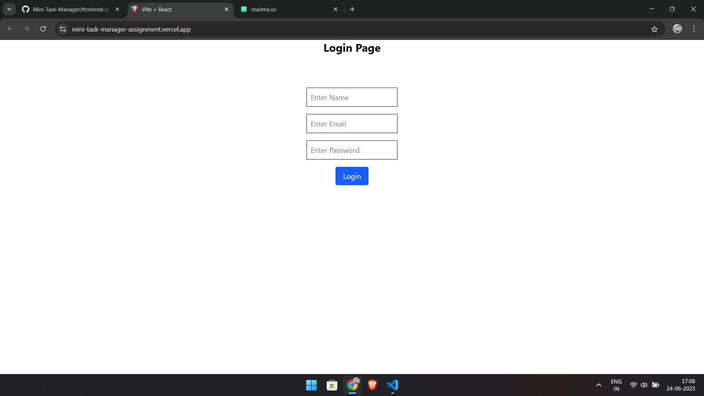
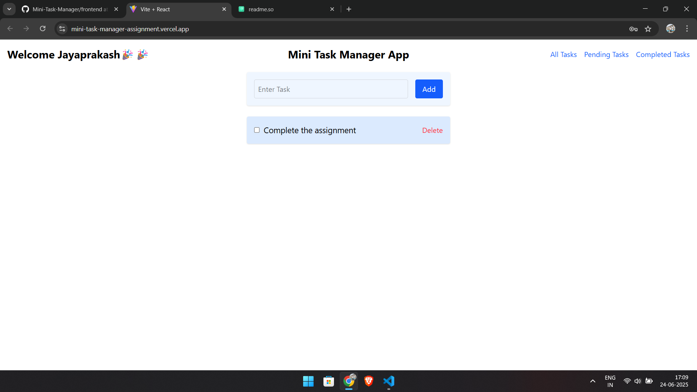
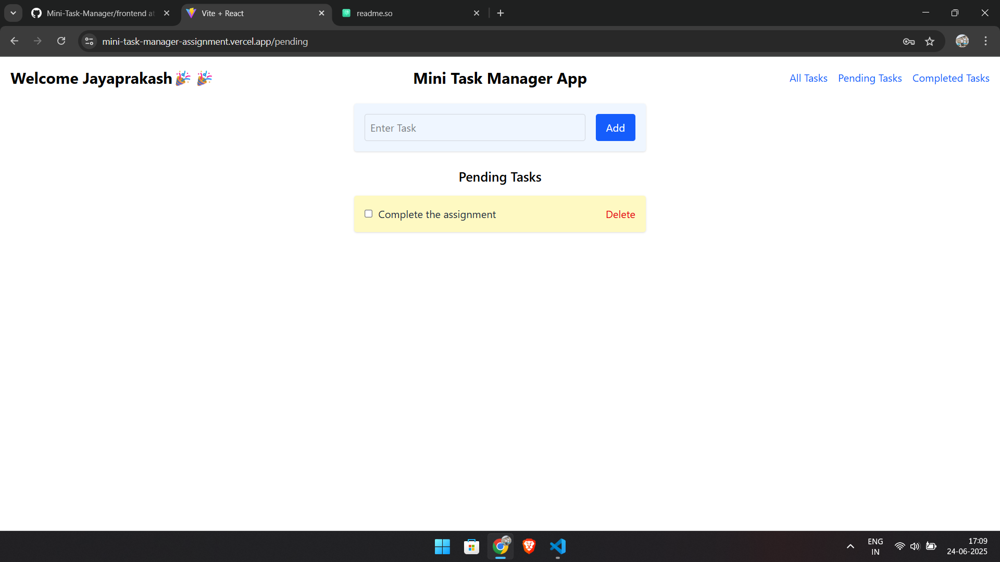
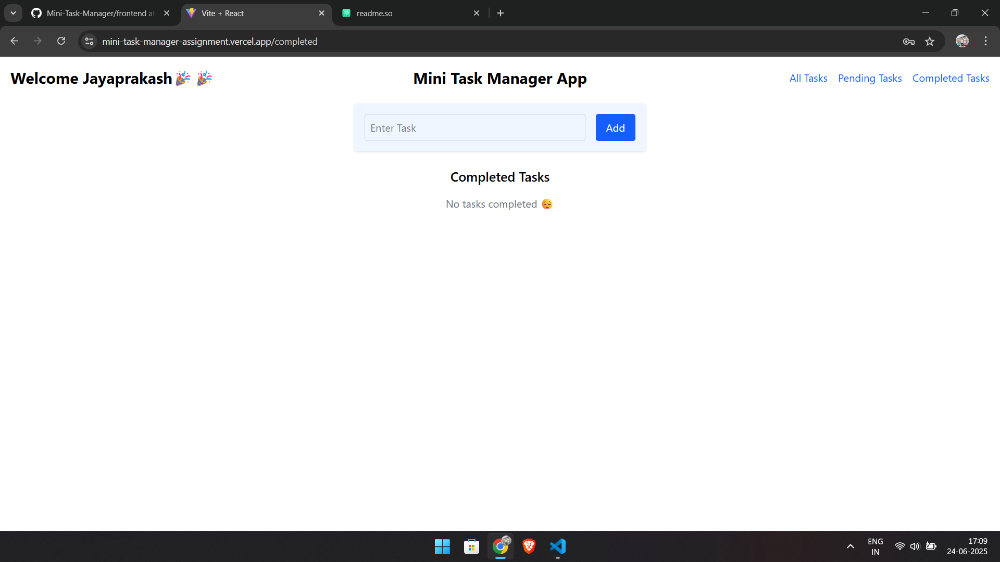

# Mini Task Manager application

This is a Task Manager application where users can add their tasks and click on completed when they completed their task.
And also delete task whenever they want..


## Tech Stack

**Frontend:** React, TailwindCSS

**Server:** Node, Express , MongoDB

**Host:** Frontend on Vercel and
          Backend on render


## Installation

Install my-project with npm

frontend:-
```bash
  1.cd frontend
  2.npm install
  3.npm run dev
```
backend:-
```bash
  1.cd server
  2.npm install
  3.npm start
```

## Screenshots






